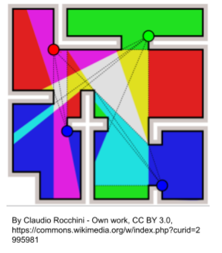
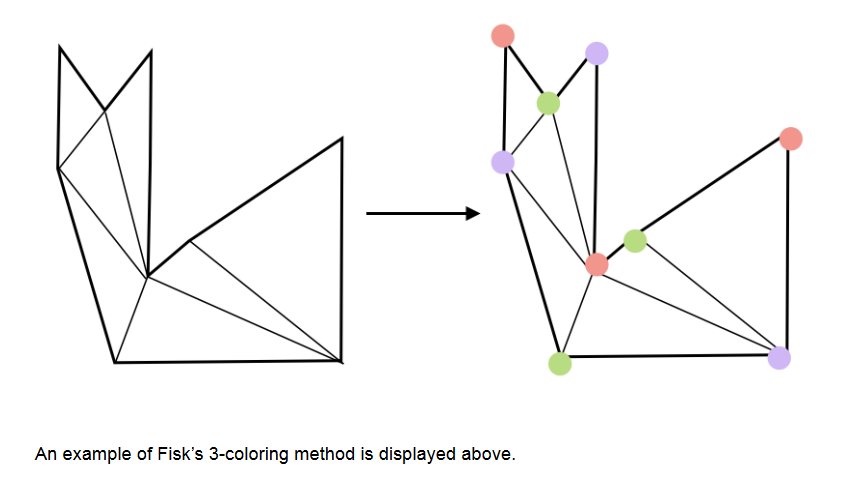

# The Art Gallery Problem

## Problem Statement

The Art Gallery Problem was introduced by Victor Klee in 1973. The problem arose as
another question in computational geometry as there regularly was in that era. It
revolved around a simple question, if you have a polygon(or art gallery as a more
‘practical’ case), what is the minimum number of guards that you need to observe
the entire gallery? Also, note that the guards must be on one of the vertices.
We decided to focus on the 2-dimensional
version of the problem, so basically,
the top-down view as shown in the figure
to the right. Throughout history,
different mathematicians have attempted
to give their versions of a solution to it,
some via geometrical methods and other
via techniques linked to the ‘Discrete
Mathematics’ side of the problem.
The general conclusion to the problem
was that ⌊n/3⌋ was the minimum
number of guards that was required.
<p align="center">
  
</p>

## Previous Attempts
### 1. Chaval's Art Gallery Theorem

 - When Victor Glee came up with the
problem, he immediately went to Václav Chvátal, who gave an upper bound on
the minimal number of guards. The theorem states:-

        “To guard a simple polygon with n vertices, ⌊n/3⌋ guards are always sufficient and sometimes necessary.”
### 2. Fisk's Short Proof
 - First, the polygon is triangulated (without adding extra
vertices), which is possible, because the existence of triangulations is proven
under certain verified conditions. The vertices of the resulting triangulation graph
may be 3-colored. Clearly, under a 3-coloring, every triangle must have all three
colors. The vertices with any one color form a valid guard set, because every
triangle of the polygon is guarded by its vertex with that color. Since the three
colors partition the n vertices of the polygon, the color with the fewest vertices
defines a valid guard set with at most ⌊n/3⌋ guards
<p align="center">
  
</p>

## Explanation of Approach

Steps for our Apporach :
 - Triangulate the polygon by using the Ear Clipping algorithm 
   [Ear Clipping Algorithm: from a cyclic list of points we take the first three points and check if the triangle formed by them lie inside the main polygon and if yes the second point is removed and that triangle is stored and this process is continued until there are only three points left in the array of cyclic vertices - which form a triangle themselves]
 - After triangulating the polygon try tri-colouring the newly triangulated polygon 
 - Upon tri-colouring the colour that occurs the least is the most probable locations for the guards to be set to cover the entire polygon
 - Inorder to return the best possible positions of the code we have run a for loop making each point of the vertice list as a starting point for triangulation and find out the most optimized positions for the guards to be placed.


## File Structure
```
|
|---DM-main
|       |---Graph_Library.py
|       |
|       |---GUI.py
|       |
|       |---Triangulation.py
|       |
|       |---main.py
|       |
|       |---testInput.txt
|       |
|       |---Readme.md
|       |
|

```
## Explanation of Code

### Graph_Library.py
```
It contains functions for the basic initialization of the art gallery in the form of a boolean matrix with
functions like:
Graph +--------------------------------------------------------------------------------------------------------+
| - addVertice() - takes in x and y coordinates and replaces the point in the corresponding point in     |
|the matrix with 1                                                                                       |
| - addEdge() - takes in a set of two coordinates and joins them (as in creates a relation between       |
|them                                                                                                    |
|a line)                                                                                                 |
| - displayGraph() -  draws the corresponding graph on matplotlib                                        |
| - textGenerate() - function for creating a art gallery from a text file containing all the points in a |
|cyclic order                                                                                            |
| - onClick() - function to creating the art gallery using mouse clicks (left click for placing the point|
|and once done  right click to commit the changes and then closing the screen for registering the newly  |
|formed  gallery)                                                                                        |
| - getList() - returns the list of vertices in a cyclic order                                           |
+--------------------------------------------------------------------------------------------------------+
Vertex
+-----------------------------------------------------------------+
| - get() - returns the x and y coordinates as a two element list |
+-----------------------------------------------------------------+
Edge
+---------------------------------------------------------------------+
| - get() - returns the two vertices of an edge as a two element list |
+---------------------------------------------------------------------+
```
### Triangulation.py
```
+--------------------------------------------------------------------------------------------------------+
| - plot_polygon_and_triangles() - this function takes in the main polygon along with the list of all the|
|valid triangles formed and a list of guard positions which has a default value of [] to plot the final  |
| output of the code on matplotlib.                                                                      |
| - triangulate() - takes in the list of all vertices of the polygon in a cyclic order and then runs     |
|the ear clipping algorithm and hence returning a list of valid triangles formed by the vertices of      |
|the polygon                                                                                             |
| - count_guards() - this function takes in the list of valid triangles for the vertice and then finds   |
| the positions of where the guards can be place in the gallery using the tri-colouring algorithm and    |
|taking into account only those vertices which belong to the least colour                                |
| - OptimizedGuardCount() - it takes in the list of vertices and then calculates the minimum number of   |
|guards when triangulation is started from each point of the polygon which is then returned              |
+--------------------------------------------------------------------------------------------------------+
```
### GUI.py
```
+--------------------------------------------------------------------------------------------------------+
| - __init__() : used for initializing all the main variables along with the structure of the GUI        |
| - preview() : used for displaying the current art gallery onto the preview frame                       |
| - OnClcik() : used for instantiating the onClick() function from the Graph library and storing it as   |
|the current instance. It later calls the preview() method to update the previewFrame.                   |
| - textGenerate() : used for instantiating  the textGenerate() method from the Graph library and storing|
| it as the current instance. It also calls the preview() method to update the previewFrame              |
| - clear() : used for clearing up the previewFrame along with all the main variables that were          |
|initiallized by the __init__()                                                                          |
+--------------------------------------------------------------------------------------------------------+

```
### main.py
+--------------------------------------------------------------------------------------------------------+
| contains the call for the GUI to be launched.                                                          |
+--------------------------------------------------------------------------------------------------------+
```
```

## Assumptions
 - User doesnt give overlapping art gallery (which are not possible to exist in reality)
 - User doesn't provide multiple gallery in the same screen while using onClick()
 - User provides valid points for the gallery when using textGenerate() 
 - User runs the code from the DM-main directory and no other directory orelse it will lead to a file not found error.
 - 

## Reference
 -  https://en-academic.com/dic.nsf/enwiki/712109

 -  https://en.wikipedia.org/wiki/V%C3%A1clav_Chv%C3%A1tal

 -  https://www.cut-the-knot.org/Curriculum/Combinatorics/Chvatal.shtml

 - https://pi.math.cornell.edu/~web401/mark.artgallery.pdf

 - https://swaminathanj.github.io/cg/PolygonTriangulation.html#:~:text=Every%20simple%20polygon%20has%20at,as%20diagonal

 - https://stackoverflow.com/questions/55840924/how-to-judge-if-a-polygon-is-inside-another-polygon-in-python
## Requirements
 - matplotlib: pip install matplotlib
 
 - shapely : pip install shapely
 
 - pillow : pip install Pillow

 - tkinter : pip install tkinter

## Execution
 - for executing from terminal please change directory into the **inner** 'DM-main' directory and from there run- 
 **python main.py** / **python3 main.py**
 - Do not use WSL for runninbg the code as Pillow library is not available for it.
 - for running through IDE make sure to be running from the correct directory (**DM-main**)
 - After successfully running the main.py a GUI screen appears containing a Preview Screen, OnClick button, txt Generate button, Clear button, Generate Button and a Quit button
 - Upon clicking the OnClick button two screens get produced labeled as Screen1 and Screen2,the user can draw on screen2 using mouse clicks [left click to place the point, and once after done drawing right click to complete the shape and then closing both the Screens the drawn shape will appear on the previewFrame.]
 - Upon clicking the txtGenerate button a pop-up files dialogbox will open where you can select your desired .txt file containing the valid formate are present. [A sample input_text file is also provided (**testInput.txt**) for trial running the .txt generate button from the GUI.]
 - inorder to clear the current shape from the systsem and create in a new shape the user can click the Clear button.
 - Inorder to generate the positions for the minimum number of guards the user has to click Generate button that will create a screen with the desired output.
 - The quit button is used for closing the GUI and ending the entire code.
  
## Contributors
 - Abhirup Das [2022019]
 - Hemanth Dindigallu [2022212]
 - Armaan Singh [2022096]
